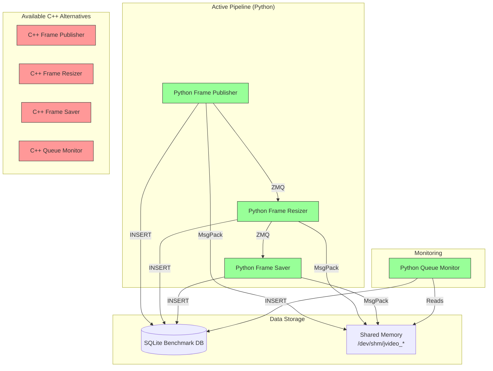

# Juni's Video Pipeline

A high-performance, multi-language video processing pipeline designed for embedded Linux systems built with Yocto. The system provides distributed video frame processing with dynamic language implementation switching, comprehensive monitoring, and robust service management through a custom Yocto meta-layer.

## Architecture Overview

Juni's Video Pipeline implements a microservices architecture where video frames flow through a series of processing stages. The system is built on ZeroMQ for inter-service communication and Redis for metrics collection and service coordination. Each service can be implemented in multiple programming languages (Python, C++, Rust) to optimize for different performance and development requirements.

### Core Components

- **Service Controller**: Central orchestration and management system
- **Frame Publisher**: Video input and frame distribution service
- **Frame Resizer**: Video frame transformation and scaling service  
- **Frame Saver**: Video frame persistence and storage service
- **Queue Monitor**: Pipeline health monitoring and performance tracking

## Yocto Integration

The JVideo Pipeline is a language-agnostic video processing system where services written in different languages (C++, Python, Rust, Go, etc.) can seamlessly work together. This document defines the communication standards and protocols that all services must follow.

Architecture

1. Shared Memory Specification
1.1 File Locations
All services expose metrics via shared memory files:

/dev/shm/jvideo_frame-publisher_metrics
/dev/shm/jvideo_frame-resizer_metrics
/dev/shm/jvideo_frame-saver_metrics
Pattern: /dev/shm/jvideo_{service-name}_metrics

1.2 Memory Layout
Each shared memory file follows this exact layout:

Offset  | Size    | Type     | Description
--------|---------|----------|-------------
0       | 64      | reserved | Legacy mutex area (unused, preserved for compatibility)
64      | 8       | uint64_t | Data size (little-endian)
72      | variable| bytes    | MessagePack data
1.3 File Properties
Size: 65536 bytes (64KB)
Permissions: 0644
Locking: Use flock() for synchronization
Writers: LOCK_EX (exclusive)
Readers: LOCK_SH (shared)
2. Metrics Data Format
2.1 Serialization Requirements
Format: MessagePack (preferred) or JSON (fallback)
Structure: MAP format (dictionary/object), not ARRAY
Encoding: UTF-8 for strings
Byte Order: Little-endian for all numeric types
Field Order: MUST follow exact order specified below
2.2 Field Specifications
BaseMetrics (All Services)
All services MUST include these fields in this exact order:

Order	Field Name	Type	Description
1	service_name	string	Service identifier (e.g., "frame-publisher")
2	service_pid	int32	Process ID
3	errors	uint64	Total error count
4	current_fps	float64	Current frames per second
5	last_update_time	int64	Nanoseconds since epoch
6	service_start_time	int64	Nanoseconds since epoch
PublisherMetrics
BaseMetrics fields 1-6, then:

Order	Field Name	Type	Description
7	frames_published	uint64	Total frames published
8	total_frames	uint64	Total frames in video
9	video_fps	float64	Video file FPS
10	video_width	int32	Video width in pixels
11	video_height	int32	Video height in pixels
12	video_healthy	bool	Video source status
13	video_path	string	Path to video file
ResizerMetrics
BaseMetrics fields 1-6, then:

Order	Field Name	Type	Description
7	frames_processed	uint64	Total frames processed
8	frames_dropped	uint64	Total frames dropped
9	processing_time_ms	float64	Average processing time
10	input_width	int32	Input frame width
11	input_height	int32	Input frame height
12	output_width	int32	Output frame width
13	output_height	int32	Output frame height
14	service_healthy	bool	Service health status
SaverMetrics
BaseMetrics fields 1-6, then:

Order	Field Name	Type	Description
7	frames_saved	uint64	Total frames saved
8	frames_dropped	uint64	Total frames dropped
9	io_errors	uint64	Total I/O errors
10	save_time_ms	float64	Average save time
11	disk_usage_mb	float64	Disk usage in MB
12	frame_width	int32	Frame width
13	frame_height	int32	Frame height
14	frame_channels	int32	Number of channels
15	disk_healthy	bool	Disk health status
16	output_dir	string	Output directory path
17	format	string	Output format (jpg/png)
18	avg_total_latency_ms	float64	Average end-to-end latency
19	min_total_latency_ms	float64	Minimum latency
20	max_total_latency_ms	float64	Maximum latency
21	avg_publish_latency_ms	float64	Average publish latency
22	avg_resize_latency_ms	float64	Average resize latency
23	avg_save_latency_ms	float64	Average save latency
24	tracked_frames	uint64	Number of tracked frames
3. ZMQ Communication Protocol
3.1 Transport Configuration
Pattern: PUB/SUB
Ports:
Publisher → Resizer: 5555
Resizer → Saver: 5556
High Water Mark: 100 messages
Linger: 1000ms
3.2 Message Format
Each message consists of exactly 2 parts:

Part 1: Metadata (JSON string, UTF-8 encoded)
Part 2: Frame data (JPEG compressed image)
3.3 Metadata Schema
json
{
    "frame_id": 12345,
    "timestamp": 1699123456.789,
    "width": 1280,
    "height": 720,
    "channels": 3,
    "source": "mp4",
    "tracking": {
        "frame_id": 1699123456789000000,
        "sequence": 12345,
        "source_ts": 1699123456.789,
        "publish_ts": 1699123456.790,
        "resize_ts": 1699123456.791
    }
}
3.4 Timestamp Formats
CRITICAL: Different timestamp formats for different purposes:

Context	Format	Type	Example
Shared Memory (last_update_time)	Nanoseconds since epoch	int64	1699123456789000000
Shared Memory (service_start_time)	Nanoseconds since epoch	int64	1699123456789000000
ZMQ Metadata (timestamp)	Seconds since epoch	float64	1699123456.789
ZMQ Tracking (*_ts fields)	Seconds since epoch	float64	1699123456.789
3.5 Frame Tracking Protocol
Services add timestamps as frames flow through the pipeline:

Publisher adds:

source_ts: When frame was read from source
publish_ts: When frame was published to ZMQ
Resizer adds:

resize_ts: When resize completed
Saver uses all timestamps to calculate:

Read→Publish latency
Publish→Resize latency
Resize→Save latency
Total end-to-end latency
4. SQLite Database Format
4.1 File Locations
/var/lib/jvideo/db/publisher_benchmarks.db
/var/lib/jvideo/db/resizer_benchmarks.db
/var/lib/jvideo/db/saver_benchmarks.db
4.2 Timestamp Format
Use nanoseconds since epoch (int64) as PRIMARY KEY
Prevents collisions when multiple records are inserted per second
4.3 Schema Examples
sql
-- Publisher benchmarks
CREATE TABLE publisher_benchmarks (
    timestamp INTEGER PRIMARY KEY,  -- Nanoseconds
    frames_published INTEGER,
    total_frames INTEGER,
    current_fps REAL,
    video_fps REAL,
    errors INTEGER,
    uptime_seconds INTEGER,
    memory_usage_kb INTEGER
);
5. Implementation Guide
5.1 Python Implementation
python
import struct
import mmap
import fcntl
import msgpack
from collections import OrderedDict

class MetricsManager:
    def commit(self):
        # Ensure correct field order
        ordered_data = OrderedDict([
            ('service_name', self.metrics.service_name),
            ('service_pid', self.metrics.service_pid),
            # ... rest of fields in exact order
        ])
        
        data = msgpack.packb(ordered_data)
        
        # Lock and write
        fcntl.flock(self.file.fileno(), fcntl.LOCK_EX)
        try:
            self.mm.seek(64)  # Skip reserved area
            self.mm.write(struct.pack('<Q', len(data)))  # Little-endian
            self.mm.write(data)
            self.mm.flush()
        finally:
            fcntl.flock(self.file.fileno(), fcntl.LOCK_UN)
5.2 C++ Implementation
cpp
#include <msgpack.hpp>
#include <sys/file.h>

struct PublisherMetrics {
    std::string service_name;
    int32_t service_pid;
    // ... fields in exact order
    
    MSGPACK_DEFINE_MAP(service_name, service_pid, ...)  // Use MAP, not ARRAY
};

void updateSharedMemory() {
    msgpack::sbuffer buffer;
    msgpack::pack(buffer, metrics);
    
    flock(fd, LOCK_EX);
    uint64_t size = buffer.size();
    memcpy(mem + 64, &size, sizeof(size));
    memcpy(mem + 72, buffer.data(), size);
    msync(mem, total_size, MS_SYNC);
    flock(fd, LOCK_UN);
}
5.3 Timestamp Conversions
Python
python
# Shared memory timestamps (nanoseconds)
timestamp_ns = int(time.time() * 1e9)

# ZMQ timestamps (seconds)
timestamp_s = time.time()
C++
cpp
// Shared memory timestamps (nanoseconds)
int64_t timestamp_ns = std::chrono::system_clock::now().time_since_epoch().count();

// ZMQ timestamps (seconds)
double timestamp_s = std::chrono::duration<double>(
    std::chrono::system_clock::now().time_since_epoch()
).count();
Rust
rust
// Shared memory timestamps (nanoseconds)
let timestamp_ns = SystemTime::now()
    .duration_since(UNIX_EPOCH)
    .unwrap()
    .as_nanos() as i64;

// ZMQ timestamps (seconds)
let timestamp_s = SystemTime::now()
    .duration_since(UNIX_EPOCH)
    .unwrap()
    .as_secs_f64();
6. Testing Interoperability
6.1 Basic Tests
bash
# Test 1: All Python
systemctl start jvideo-frame-publisher-python
systemctl start jvideo-frame-resizer-python
systemctl start jvideo-frame-saver-python

# Test 2: All C++
systemctl start jvideo-frame-publisher-cpp
systemctl start jvideo-frame-resizer-cpp
systemctl start jvideo-frame-saver-cpp

# Test 3: Mixed languages
systemctl start jvideo-frame-publisher-python
systemctl start jvideo-frame-resizer-cpp
systemctl start jvideo-frame-saver-python
6.2 Monitoring
Monitor with any implementation:

bash
# Python monitor
python3 /opt/jvideo/services/queue_monitor.py

# C++ monitor
/opt/jvideo/bin/queue-monitor-cpp
6.3 Verification Checklist
 All services show as "running" in monitor
 FPS values are positive and reasonable (5-30 fps)
 Frame counts increment steadily
 Latencies are positive and reasonable (50-500ms)
 No negative latencies in frame tracking
 Database samples accumulate over time
6.4 Manual Inspection
bash
# List shared memory files
ls -la /dev/shm/jvideo_*

# Check file size (should be 65536)
stat /dev/shm/jvideo_frame-publisher_metrics

# View raw content
hexdump -C -n 256 /dev/shm/jvideo_frame-publisher_metrics

# Check database
sqlite3 /var/lib/jvideo/db/publisher_benchmarks.db "SELECT COUNT(*) FROM publisher_benchmarks;"
7. Common Issues and Solutions
7.1 Negative Latencies
Symptom: Frame tracking shows huge negative numbers like -471280397489.3ms

Cause: Mixing timestamp formats (seconds vs nanoseconds)

Solution: Ensure all ZMQ tracking timestamps use seconds as float/double

7.2 Services Not Detected
Symptom: Monitor shows services as "stopped" when they're running

Cause: Shared memory file doesn't exist or wrong path

Solution: Check service logs and verify shared memory file creation

7.3 Data Corruption
Symptom: Random crashes or garbage data

Cause: Missing file locking or wrong byte order

Solution: Implement proper flock() calls and use little-endian format

7.4 Field Order Mismatch
Symptom: Wrong values in wrong fields

Cause: MessagePack serializing fields in different order

Solution: Use MSGPACK_DEFINE_MAP in C++ and OrderedDict in Python

8. Performance Guidelines
8.1 Expected Performance
Metric	Acceptable Range	Optimal
Processing FPS	5-30	15-25
End-to-end latency	100-500ms	150-250ms
Memory usage	< 100MB/service	< 50MB
CPU usage	< 30%/service	< 20%
8.2 Optimization Tips
Pre-allocate buffers to avoid repeated allocations
Use appropriate JPEG quality (80-90 for good balance)
Batch database writes (every 1000 frames)
Use non-blocking ZMQ operations where possible
Implement frame dropping when queues are full
9. Adding New Languages
To add support for a new language:

Implement shared memory access with:

64-byte offset for data
Little-endian uint64_t size
MessagePack serialization
File locking with flock()
Implement ZMQ communication with:

Two-part messages (metadata + frame)
JSON metadata
Seconds-based timestamps
Follow field ordering exactly as specified

Test thoroughly with existing services

10. License and Contributing
This specification is part of the JVideo Pipeline project. Contributions are welcome!

When contributing:

Maintain backward compatibility
Add tests for new features
Update this documentation
Test with multiple language combinations
Version 1.0 - Last updated: 2025-07-08
